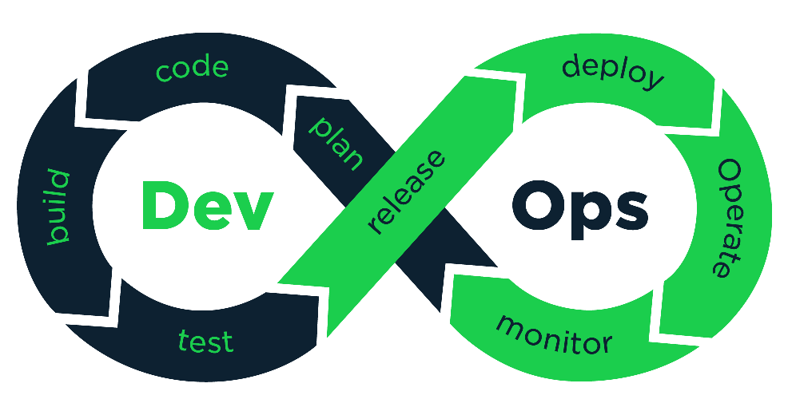
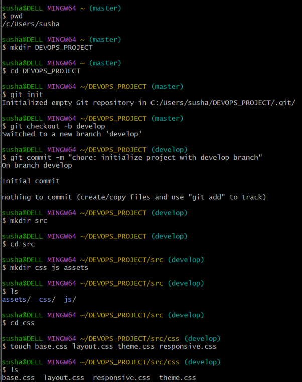
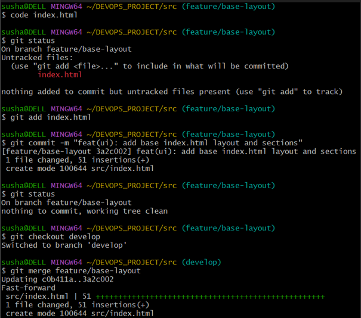
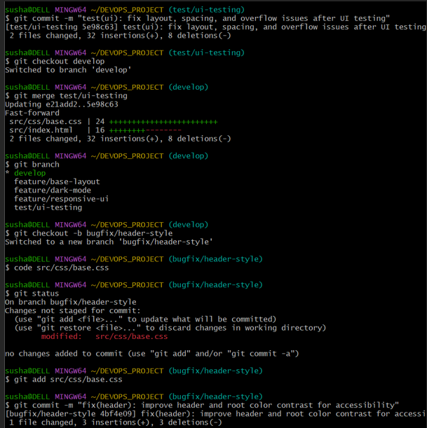
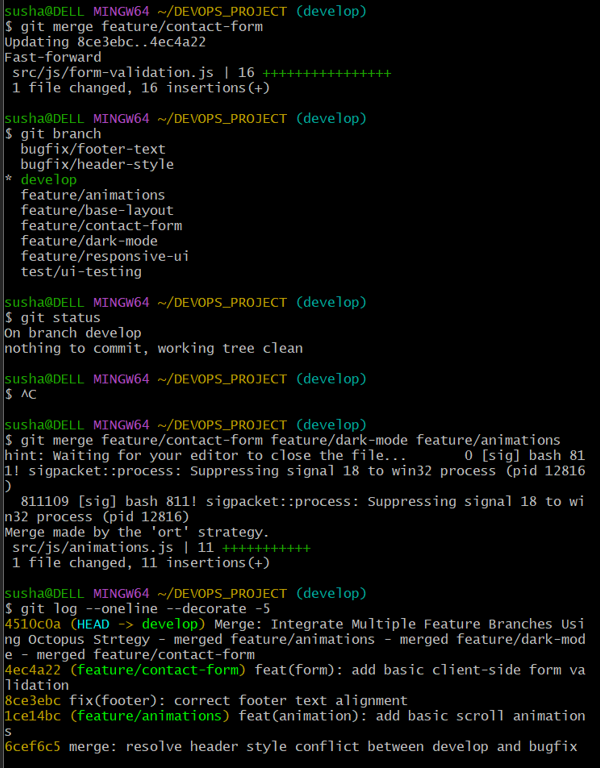
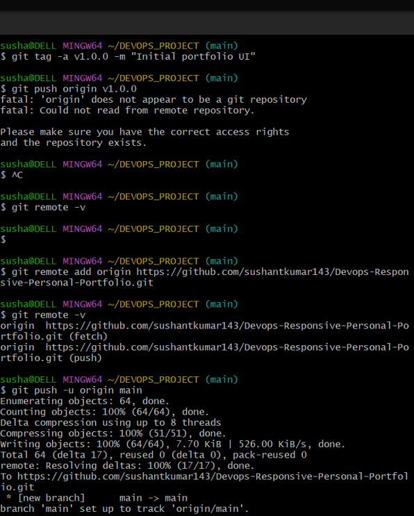
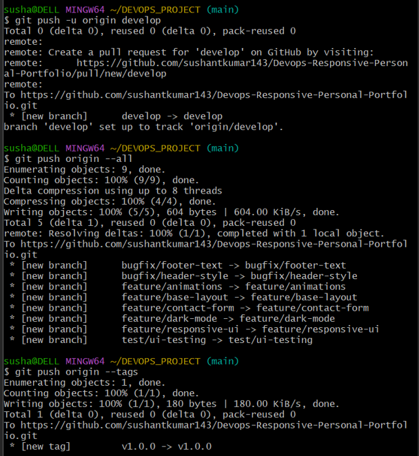
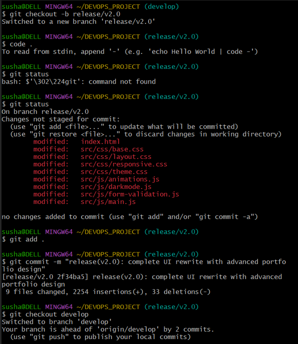
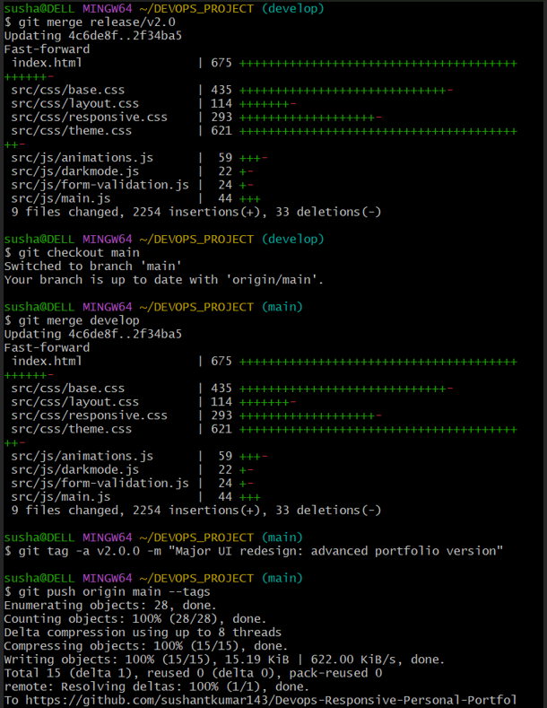

# Portfolio Project – Git Execution Flow (v1.0.0 → v2.0.0)

## Project Overview
This project demonstrates a complete professional Git workflow followed during the development of a Portfolio Web Application.  
It covers the entire lifecycle from repository initialization to a major UI redesign release (v2.0.0).  
The repository is created for academic evaluation and showcases real-world Git practices such as branching, merging, rebasing, conflict resolution, tagging, and release management.


---

## Technologies Used
HTML • CSS • JavaScript • Git (Git Bash) • GitHub



---

## Project Structure

```text
Portfolio_Project/
├── index.html
├── assets/
├── css/
├── js/
├── images/
├── Docs/
└── README.md
```
---

## System Architecture

The Portfolio Web Application follows a **client-side, modular architecture** designed to ensure simplicity, scalability, and maintainability. The system is built using standard web technologies and integrates Git and GitHub for effective version control and development management.

### Architecture Overview
The application runs entirely on the **client side**, where users interact with the portfolio through a web browser. The browser loads HTML files, applies CSS for styling, and executes JavaScript for dynamic behavior. All static resources such as images and assets are organized in dedicated directories to maintain a clean and structured codebase.


### Component Breakdown

- **Presentation Layer (HTML)**  
  Defines the structure and layout of the portfolio pages, including sections such as profile, skills, projects, and contact information.

- **Styling Layer (CSS)**  
  Manages the visual appearance of the application, including layouts, responsiveness, animations, and overall theme consistency.

- **Behavior Layer (JavaScript)**  
  Handles interactivity and dynamic functionality such as navigation effects, animations, user interactions, and form handling.

- **Assets & Media Layer**  
  Stores static resources such as images, icons, and other media files used throughout the application.

- **Version Control Layer (Git & GitHub)**  
  Tracks code changes, manages branches, handles merges, resolves conflicts, and maintains versioned releases using a professional Git workflow.

### Workflow Architecture
1. The user accesses the portfolio application through a web browser.
2. HTML files are loaded and rendered by the browser.
3. CSS styles are applied to ensure proper layout and responsiveness.
4. JavaScript enhances the UI with dynamic and interactive features.
5. Static assets are fetched from organized asset directories.
6. Source code changes are managed, versioned, and released using Git and GitHub.

### Architectural Characteristics
- Modular and well-organized project structure  
- Client-side rendering for fast performance  
- Clear separation of concerns (HTML, CSS, JavaScript)  
- Scalable design for future enhancements  
- Professional Git-based development and version control workflow  

---

## Git Execution Flow

### Repository Setup
- Initialized Git repository using `git init`
 ```bash
git init
git add .
git commit -m "Initial commit"
```

- Created base project structure
 ```bash
mkdir assets css js images
touch index.html README.me
```
- Performed initial commit (`chore: setup initial project structure`)
 ```bash
git add .
git commit -m "chore: setup initial project structure"
```
- Created and switched to `develop` branch
```bash
git checkout -b develop
```



### Feature Development
- Created feature branches:
```bash
git checkout -b feature/base-layout
git checkout -b feature/responsive-ui
git checkout -b feature/dark-mode
git checkout -b feature/contact-form
git checkout -b feature/animations
```
  - `feature/base-layout`
  - `feature/responsive-ui`
  - `feature/dark-mode`
  - `feature/contact-form`
  - `feature/animations`
- Implemented features with meaningful commits
```bash
git add .
git commit -m "feat: implement base layout"
git commit -m "feat: add responsive UI"
git commit -m "feat: implement dark mode"
```


### Testing & Bug Fixes
- Created UI testing branch `test/ui-testing`
  ```bash
  git checkout -b test/ui-testing
  ```
- Created bugfix branches:
  - `bugfix/header-style`
  - `bugfix/footer-text`
   ```bash
   git checkout -b bugfix/header-style
   ```
- Applied bug fixes with independent commits
  ```bash
  git add .
  git commit -m "fix: correct header styling"
  ```
  

### Merge, Rebase & Advanced Workflow
- Merged bugfix branches with manual conflict resolution
   ```bash
   git checkout develop
   git merge bugfix/header-style
   ```
- Rebasing feature branches onto `develop`
   ```bash
   git checkout feature/base-layout
   git rebase develop
   ```
- Performed advanced octopus merge
   ```bash
   git checkout develop
   git merge feature/base-layout feature/responsive-ui feature/dark-mode feature/contact-form feature/animations
   ```
- Visualized commit history using:
   ```bash
   git log --oneline --graph --all --decorate
   ```


### Version v1.0.0 Release
- Refactored project structure
- Created `main` branch
- Merged `develop` into `main`
- Created release tag `v1.0.0`
- Created patch release tag `v1.0.1`

  

### Remote Repository Management
- Added remote origin
- Pushed all branches to GitHub
- Pushed all tags to GitHub

   

### Major Update – v2.0.0
- Created release branch `release/v2.0`
- Performed full UI replacement
- Single commit for complete UI rewrite
- Merged release branch into `develop` and `main`
- Created final release tag `v2.0.0`
- Pushed final release to GitHub

   

### Cleanup & Verification
- Deleted unused branches
- Verified final version and release tags

   

---

## Branches Used
`main`, `develop`, `feature/*`, `bugfix/*`, `test/ui-testing`, `release/v2.0`  
Each branch contains at least one meaningful commit.

---

## Merge Conflict Demonstration
Merge conflicts were intentionally created during branch merges, resolved manually by editing conflicted files, removing conflict markers, and committing the final merged version successfully.

---
 

## Git Commit Graph
The commit graph clearly demonstrates:
- Parallel feature development
- Bugfix integration
- Rebasing workflow
- Octopus merge
- Version tagging
- Major version upgrade

---

## Screenshots
Screenshots included in the repository demonstrate:
- Repository initialization
- Branch creation
- Feature and bugfix commits
- Merge conflict resolution
- Commit graph visualization
- Pushing branches and tags to GitHub

---

## Challenges Faced
- Managing multiple branches simultaneously
- Resolving merge conflicts correctly
- Understanding rebase vs merge
- Maintaining a clean and readable commit history

---

## Learning Outcomes
 
- Practical implementation of advanced Git workflows
- Branching, merging, and release strategies
- Merge conflict handling
- Professional GitHub documentation
- Industry-standard version control practices

---

## Conclusion
This project successfully demonstrates a complete end-to-end Git execution flow from v1.0.0 to v2.0.0, showcasing a well-structured and industry-standard approach to version control. Throughout the development lifecycle, best practices such as branch-based development, meaningful commit messages, feature isolation, bug fixing, rebasing, conflict resolution, and release tagging were consistently followed.

The use of multiple branches for features, testing, bug fixes, and releases reflects a real-world collaborative workflow, while the intentional creation and resolution of merge conflicts highlights practical problem-solving skills in Git. Advanced operations such as octopus merging, semantic versioning, and release management further strengthen the technical depth of the project.

Overall, this repository not only fulfills academic evaluation requirements but also demonstrates professional Git usage, clean version history maintenance, and a clear understanding of modern software development workflows, making it a strong representation of real-world version control practices.

---

## Author
**Sushant Kumar**  
Department of Computer Science & Engineering  
Lovely Professional University
